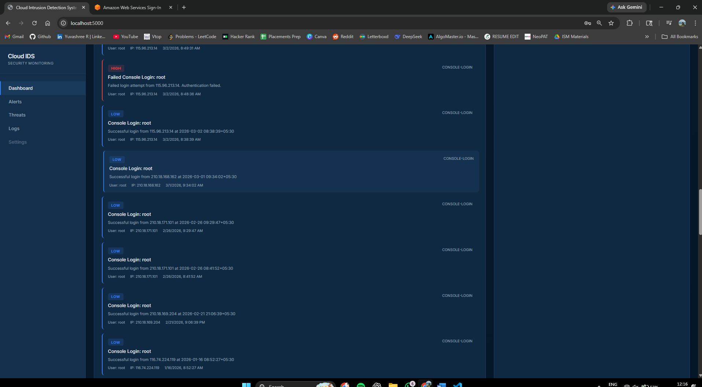
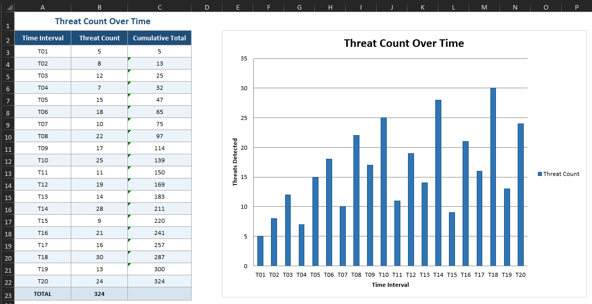
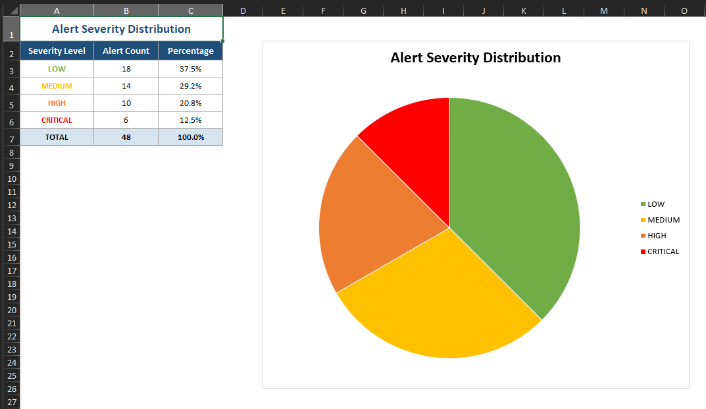
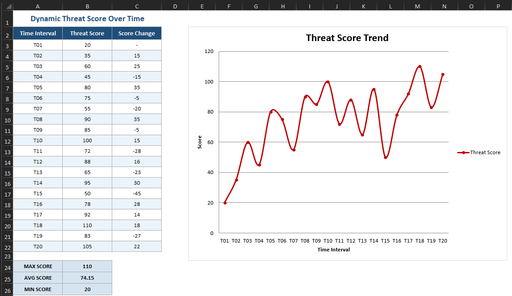

# Cloud IDS — Cloud Intrusion Detection System

Cloud IDS is a web-based intrusion detection system designed for monitoring AWS cloud environments. It leverages AWS CloudTrail logs and IAM services to detect real-time security threats such as brute force attacks, privilege escalations, unauthorized resource creations, and compliance violations. The application features a user-friendly dashboard with real-time alerts, threat scoring, and manual scanning capabilities, enabling administrators to proactively secure their cloud infrastructure.

---

## Screenshots

### 🔹 Dashboard


### 🔹 Running Security Scan


### 🔹 Security Threats


### 🔹 Logs


### 🔹 Root Login Alerts


### 🔹 IAM Users


### 🔹 EC2 Instances


### 🔹 S3 Buckets


### 🔹 Graph Analysis




---

## Setup

### 1. Clone the repository

```bash
git clone <repository-url>
cd cloud-ids
```

### 2. Install dependencies

```bash
pip install -r requirements.txt
```

### 3. Configure environment variables

Create a `.env` file in the project root:

```env
AWS_ACCESS_KEY_ID=your_access_key
AWS_SECRET_ACCESS_KEY=your_secret_key
AWS_REGION=ap-south-1
```

### 4. Run the application

```bash
python app.py
```

### 5. Open the dashboard

Navigate to [http://localhost:5000](http://localhost:5000) in your browser.

---

## Demo Mode

To run without AWS credentials, set the following in your `.env` file:

```env
DEMO_MODE=true
```

This will populate the dashboard with simulated data for evaluation and testing purposes.

---

## AWS Permissions Required

Attach the following IAM policy to the user or role used by Cloud IDS:

```json
{
    "Version": "2012-10-17",
    "Statement": [
        {
            "Effect": "Allow",
            "Action": [
                "cloudtrail:LookupEvents",
                "s3:ListAllMyBuckets",
                "s3:GetBucketAcl",
                "s3:GetBucketPolicy",
                "ec2:DescribeInstances",
                "ec2:DescribeSecurityGroups",
                "iam:ListUsers",
                "iam:ListRoles",
                "iam:GetUser"
            ],
            "Resource": "*"
        }
    ]
}
```

---

## Threat Detection Rules

| Rule ID | Threat | Severity |
|---------|--------|----------|
| T001 | Brute Force Login | HIGH |
| T002 | Root Account Login | CRITICAL |
| T003 | Security Group Deleted | HIGH |
| T004 | CloudTrail Logging Stopped | CRITICAL |
| T005 | New IAM User Created | MEDIUM |
| T006 | Privilege Escalation | HIGH |
| T007 | EC2 in Unusual Region | MEDIUM |
| T008 | Overprivileged Role | HIGH |
| T009 | New EC2 Instance Created | LOW |
| T010 | New S3 Bucket Created | LOW |
| T011 | MFA Not Enabled | HIGH |

---

## Tech Stack

| Component | Technology |
|-----------|------------|
| Backend framework | Flask, Flask-SocketIO |
| AWS integration | boto3 (AWS SDK for Python) |
| Anomaly detection | scikit-learn |
| Real-time alerts | WebSockets via Flask-SocketIO |
| Frontend | HTML, CSS, JavaScript |
| Environment config | python-dotenv |

---

## Project Structure

```
cloud-ids/
├── app.py                  # Main application entry point
├── requirements.txt        # Python dependencies
├── .env                    # Environment variables (not committed)
├── templates/              # HTML dashboard templates
├── static/                 # CSS, JS, and static assets
└── Screenshots/            # Dashboard screenshots
```

---

## Requirements

**Software**

- Operating System: Windows 10+, macOS 10.14+, or Ubuntu 18.04+
- Python: 3.8 or higher
- Package Manager: pip (bundled with Python 3.4+)
- Web Browser: Chrome, Firefox, or Edge

**Hardware**

- Processor: 1 GHz dual-core CPU or higher
- RAM: 2 GB minimum (4 GB recommended)
- Storage: 500 MB free disk space
- Network: Stable internet connection (required for AWS API calls)

---

## License

This project is intended for academic and research purposes.
